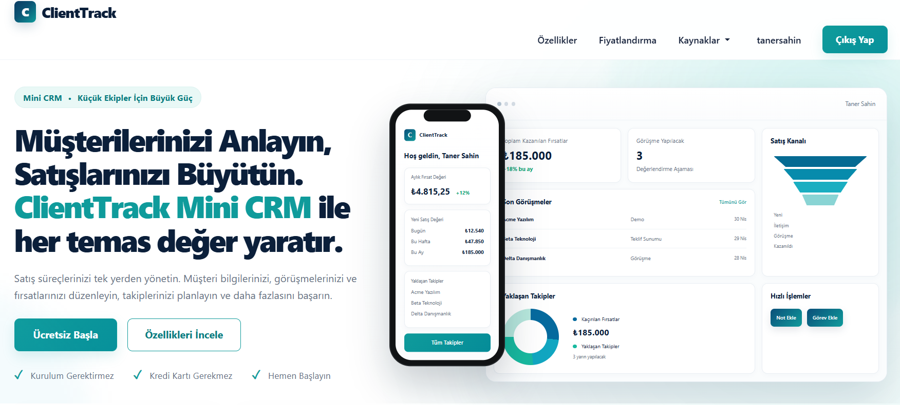
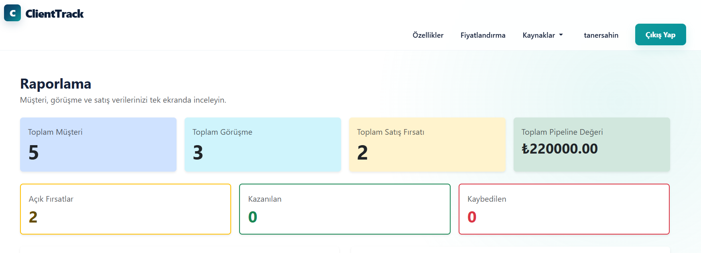
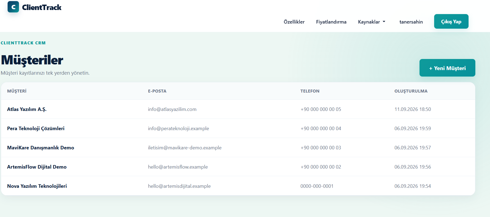
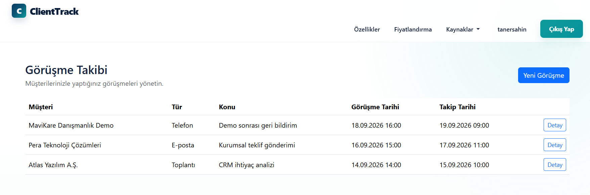
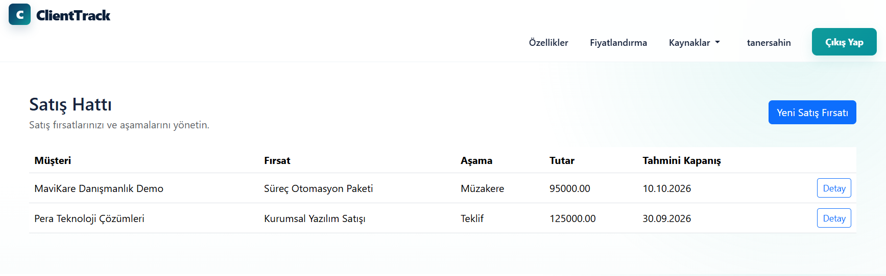
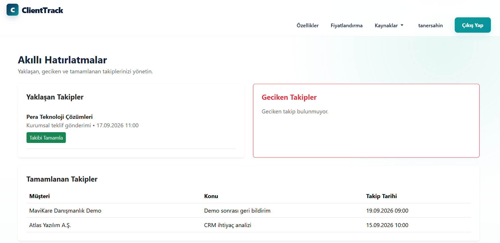
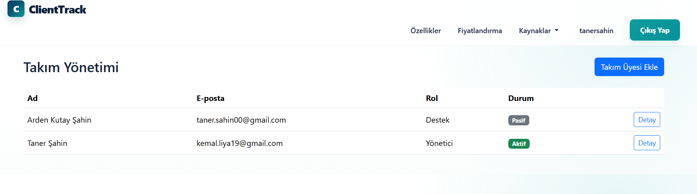
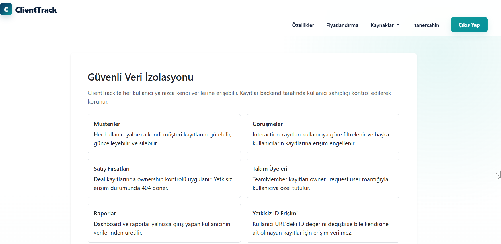

# ClientTrack

ClientTrack is a backend-focused Django mini CRM application designed to help users manage clients, interactions, sales opportunities, follow-up activities, team members, and business reports in one place.

The project focuses on secure backend architecture, authentication, authorization, ownership control, strict user-specific data isolation, and automated testing.

## Key Highlights

- Django-based CRM application
- Secure authentication and authorization
- Strict user-specific data isolation
- Client management
- Interaction tracking
- Sales pipeline management
- Smart follow-up reminders
- Team management
- Reports and dashboard
- Ownership-protected CRUD operations
- 61 automated tests passing
- Modular Django application structure

## Features

### Authentication

- User registration
- User login
- POST-based logout
- Custom Django user model
- Login-protected application features
- Authenticated user-specific data access
- Automated authentication tests

### Client Management

- Create, view, update, and delete clients
- User-specific client ownership
- Ownership-protected detail pages
- Secure update and delete operations
- Client data isolation between users

Each client belongs to the authenticated user. Client querysets are restricted using ownership filtering so one user cannot access another user's client records.

### Interaction Management

- Create, view, update, and delete interactions
- Associate interactions with clients
- Track different interaction types
- Store follow-up dates
- User-specific interaction filtering
- Ownership protection for interaction records

Interactions allow users to keep track of communication and follow-up activities related to their clients.

### Sales Pipeline

- Create and manage sales opportunities
- Track deal stages
- Store opportunity values
- Monitor open, won, and lost deals
- User-specific sales records
- Ownership-protected CRUD operations

The sales module provides a simple CRM pipeline for tracking opportunities throughout the sales process.

### Smart Follow-up Reminders

- Track upcoming follow-ups
- Detect overdue follow-ups
- Track completed follow-ups
- Mark follow-ups as completed
- POST-based state-changing operations
- User-specific reminder filtering
- Security and ownership tests

The reminder system uses interaction follow-up dates to help users identify activities that require attention.

### Team Management

- Create, view, update, and delete team members
- Store team member name and email
- Assign team roles
- Activate or deactivate team members
- User-specific team ownership
- Ownership-protected detail, update, and delete operations

Supported roles include:

- Manager
- Sales
- Support
- Other

Each team member belongs to the authenticated owner and cannot be accessed by another user.

### Reports and Dashboard

ClientTrack includes user-specific business reports and dashboard statistics.

Reports include:

- Total client count
- Total interaction count
- Total deal count
- Pipeline value
- Open deals
- Won deals
- Lost deals
- Deal stage summary
- Recent interactions
- Upcoming follow-ups

All report calculations are restricted to the authenticated user's own records.

### Secure Data Isolation

ClientTrack is designed around strict user-specific data isolation.

The core security rule is:

> An authenticated user can access only records that belong to that user.

Ownership filtering is enforced on the backend using Django ORM querysets.

Example:

```python
Client.objects.filter(user=request.user)
```

Detail, update, and delete operations enforce ownership checks:

```python
get_object_or_404(
    Model,
    pk=pk,
    user=request.user,
)
```

Team member ownership follows the same principle using the `owner` field.

This prevents users from accessing another user's records by manually changing object IDs in URLs.

The isolation model applies to:

- Clients
- Interactions
- Sales opportunities
- Follow-up reminders
- Team members
- Reports and dashboard data

Unauthorized record access returns a 404 response rather than exposing another user's private data.

## Authentication, Authorization and Ownership

ClientTrack separates three important backend security concepts:

**Authentication**

Determines who the user is.

**Authorization**

Determines what the authenticated user is allowed to access.

**Ownership**

Determines which records belong to the authenticated user.

These concepts are enforced throughout the application's backend rather than relying on frontend restrictions.

## Tech Stack

### Backend

- Python 3.12.10
- Django 5.2.17
- Django ORM
- Django Templates

### Database

- SQLite for local development
- PostgreSQL planned for production

### Frontend

- HTML5
- CSS3
- Bootstrap 5

### Testing

- Django TestCase
- Django Test Client
- Automated security and regression testing

### Development and Version Control

- Git
- GitHub
- Visual Studio Code

## Automated Testing

ClientTrack includes an automated test suite built with Django's testing framework.

Current test status:

**61 tests passed successfully.**

The test suite verifies important application behavior including:

- Authentication
- Registration
- Login
- POST logout
- CRUD operations
- Login protection
- Authorization
- Ownership protection
- User isolation
- Client security
- Interaction security
- Sales security
- Follow-up reminder security
- Team member security
- Reports
- Secure data isolation page

### Run the Tests

```bash
python manage.py test
```

Expected result:

```text
Ran 61 tests

OK
```

Automated testing is especially important in ClientTrack because security rules must continue working as new application features are added.

## Project Structure

ClientTrack follows a modular Django application architecture.

```text
clienttrack/
│
├── accounts/          # Authentication and custom user
├── clients/           # Client management
├── interactions/      # Client interactions and follow-ups
├── sales/             # Sales opportunities and pipeline
├── reports/           # Dashboard and business reports
├── core/              # Homepage and core application views
│
├── config/            # Django project configuration
├── templates/         # Global templates
├── static/            # CSS and static assets
├── screenshots/       # Project screenshots
│
├── manage.py
├── requirements.txt
├── .env.example
└── README.md
```

Each Django application is responsible for a specific part of the CRM system. This keeps the project modular, maintainable, and easier to test.

## Installation and Setup

Follow the steps below to run ClientTrack locally.

### 1. Clone the Repository

```bash
git clone https://github.com/taner-sahin/ClientTrack.git
cd ClientTrack
```

### 2. Create a Virtual Environment

```bash
python -m venv venv
```

Activate the virtual environment on Windows:

```bash
venv\Scripts\activate
```

### 3. Install Dependencies

```bash
pip install -r requirements.txt
```

### 4. Configure Environment Variables

Create a `.env` file based on the provided `.env.example` file.

Sensitive configuration such as the Django secret key should not be committed to GitHub.

### 5. Apply Database Migrations

```bash
python manage.py migrate
```

### 6. Run the Development Server

```bash
python manage.py runserver
```

The application will then be available through Django's local development server.

## Environment Variables

ClientTrack uses environment variables to separate sensitive configuration from source code.

The repository includes:

```text
.env.example
```

Create a local `.env` file based on this example and provide the required configuration values.

The real `.env` file should remain private and must not contain credentials committed to the repository.

## Screenshots

The screenshots below demonstrate the main features and workflows of ClientTrack.

### Home Page



### Dashboard and Reports

User-specific CRM statistics including clients, interactions, sales opportunities, pipeline value, and deal status summaries.



### Client Management

Create and manage client records with user-specific ownership protection.



### Interaction Tracking

Track client interactions, communication activities, and follow-up information.



### Sales Pipeline

Manage sales opportunities, pipeline stages, deal values, and estimated closing dates.



### Smart Follow-up Reminders

Monitor upcoming, overdue, and completed follow-up activities.



### Team Management

Manage team members, roles, contact information, and active status.



### Secure Data Isolation

ClientTrack applies backend ownership controls so authenticated users can access only their own records.



## Security Design

Security and user isolation are core architectural requirements of ClientTrack rather than optional frontend features.

Important security principles include:

- Authentication-protected application pages
- Backend ownership filtering
- User-specific querysets
- Ownership checks for detail operations
- Ownership checks for update operations
- Ownership checks for delete operations
- POST for state-changing operations
- CSRF protection
- User-specific dashboard statistics
- User-specific reports
- Automated security tests

The frontend is never trusted to enforce ownership.

Security rules are applied directly in Django views and querysets.

## Production Deployment

Production deployment is the next stage of ClientTrack.

The planned production architecture is:

```text
Internet
   ↓
Domain / DNS
   ↓
HTTPS / SSL/TLS
   ↓
Nginx
   ↓
Gunicorn
   ↓
Django
   ↓
PostgreSQL
```

Planned production technologies:

- VPS
- Ubuntu/Linux
- PostgreSQL
- Gunicorn
- Nginx
- Domain
- DNS
- SSL/TLS
- HTTPS
- HSTS

This section will be updated after ClientTrack is deployed to the production environment.

## Future Improvements

Possible future improvements include:

- REST API development
- Django REST Framework integration
- API authentication
- Docker containerization
- Redis
- Celery background tasks
- Email notifications
- Additional CRM analytics
- CI/CD
- Cloud deployment improvements

## Project Status

Current ClientTrack status:

- Core backend development: Complete
- Authentication: Complete
- Client Management: Complete
- Interaction Management: Complete
- Sales Pipeline: Complete
- Reports and Dashboard: Complete
- Smart Follow-up Reminders: Complete
- Team Management: Complete
- Secure Data Isolation: Complete
- Automated Tests: 61 tests passing
- Security Audit: Complete
- Professional README: In Progress
- Project Screenshots: In Progress
- PostgreSQL Production Database: Planned
- Gunicorn: Planned
- Nginx: Planned
- Domain/DNS: Planned
- SSL/TLS and HTTPS: Planned
- HSTS: Planned
- Production Deployment: Planned

---

## About

ClientTrack is a backend-focused Django mini CRM project built to demonstrate secure multi-user data handling, CRM workflows, automated testing, and production-oriented Django development.